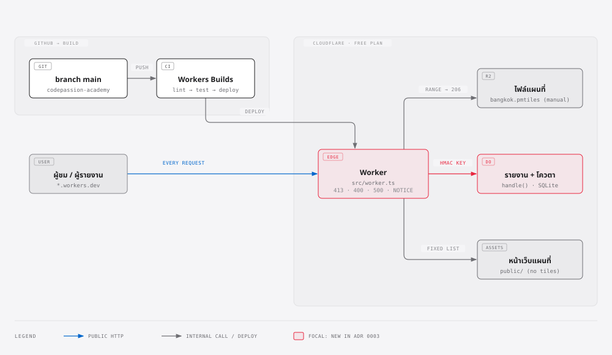
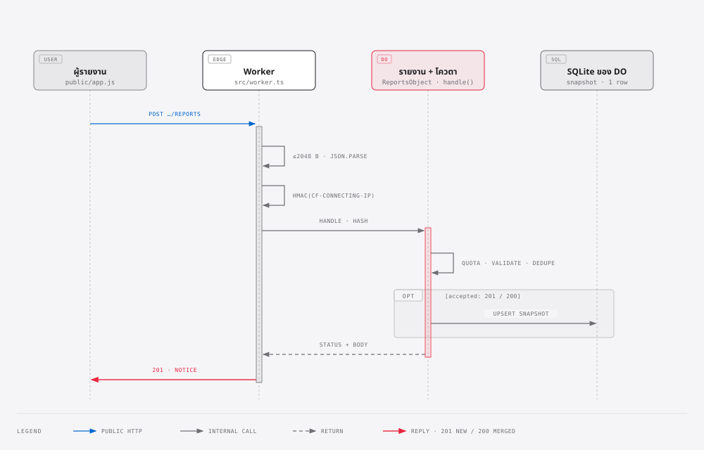

# น้ำท่วมไหม: repo ตัวอย่างของคอร์ส AI Coding with Claude

> **ตัวอย่างเพื่อการเรียนเท่านั้น ไม่ใช่ประกาศเตือนภัยทางการ**
> ข้อมูลระดับน้ำใน repo นี้เป็นข้อมูลสมมติ อย่าใช้ตัดสินใจเรื่องความปลอดภัย
> ติดตามสถานการณ์น้ำจริงจากประกาศของกรุงเทพมหานครและหน่วยงานรัฐ

แอปเล็กๆ ที่ใช้ในคอร์ส [AI Coding with Claude](https://academy.codepassion.co/courses/ai-coding-with-claude/) ของ CodePassion Academy

- **API** แสดงรายชื่อเขตและระดับน้ำล่าสุดของสถานีวัดในเขตนั้น (จากข้อมูลที่บันทึกไว้)
- **ฟีเจอร์ที่ทำในคลาส:** ให้คนในพื้นที่รายงานจุดน้ำท่วม ตั้งแต่ขั้นวางแผนจนถึงตั้งด่านตรวจอัตโนมัติ
- **หน้าเว็บแผนที่** สำหรับดูและแจ้งรายงาน

ขั้นตอนของคลาสทั้งหมดอยู่ใน [Workshop Guide](https://academy.codepassion.co/courses/ai-coding-with-claude/workshop-guide)

> **ห้ามส่งรายงานทดสอบไปที่ระบบจริง** เช่นแผนที่ ROOP TAN JAI Flood Watch (`flood-api.rooptanjai.com`)
> คนใช้แผนที่นั้นตัดสินใจจริงในช่วงน้ำท่วม อ่านข้อมูล (GET) ได้ แต่ห้ามส่งหรือลบรายงาน

**ในหน้านี้:** [เริ่มใช้](#เริ่มใช้) · [หน้าเว็บแผนที่](#หน้าเว็บแผนที่) · [Deploy](#deploy-ขึ้น-cloudflare) · [มีอะไรใน repo](#มีอะไรใน-repo) · [Branch และ tag](#branch-และ-tag)

## เริ่มใช้

ต้องมี Node.js 22 ขึ้นไป

```bash
git clone https://github.com/codepassion-academy/ai-coding-with-claude.git
cd ai-coding-with-claude
npm install
npm test        # รัน test ทั้งหมด
npm run lint    # เช็ก type ด้วย tsc
npm run dev     # เปิด server ที่ http://localhost:3000
```

ลองเรียก API (ยิงเฉพาะ `localhost` เท่านั้น)

```bash
curl localhost:3000/districts
curl localhost:3000/districts/lat-phrao

# ส่งรายงานทดสอบ seenAt ต้องเป็นเวลาในช่วง 3 ชั่วโมงที่ผ่านมา มี Z หรือ +07:00
curl -X POST localhost:3000/districts/lat-phrao/reports \
  -H 'content-type: application/json' \
  -d "{\"landmark\":\"ปากซอยลาดพร้าว 71\",\"depth\":\"knee\",\"seenAt\":\"$(date -u +%Y-%m-%dT%H:%M:%SZ)\"}"
```

| ลองทำ | ผลที่ได้ |
| ----- | ------- |
| ส่งข้อความเดิมซ้ำ | `200` และ `merged: true` |
| ส่งเกิน 5 ครั้งใน 1 ชั่วโมง | `429` พร้อม `Retry-After` |
| ใส่เบอร์โทรในจุดสังเกต | ถูกเก็บเป็น `***` |

## หน้าเว็บแผนที่

เปิด <http://localhost:3000> หลัง `npm run dev` จะเห็นแผนที่ หมุดจุดที่มีคนรายงาน สถานีวัด รายการจุด และปุ่ม **แจ้งจุดน้ำท่วม**
แท็บ **น้ำเหนืออยู่ไหน** (`/#/north`) แสดงลุ่มน้ำเจ้าพระยาทั้งลุ่ม และ `/?demo` เปิดข้อมูลจำลอง

- **ตำแหน่งหมุดเป็นค่าประมาณจากเขต** API ไม่เก็บพิกัดของผู้รายงาน (spec §5, RPT-REQ-013)
- **ไม่ดึงอะไรจากเว็บอื่น** ตัวแผนที่ใช้ MapLibre GL JS กับไฟล์ PMTiles ที่ host เอง (ดู [ADR 0001](docs/adr/0001-maplibre-pmtiles-basemap.md)) ไฟล์ทุกอย่างของแผนที่อยู่ใน `public/vendor/` และเสิร์ฟจาก server นี้
- **ไฟล์แผนที่กรุงเทพฯ** `public/tiles/bangkok.pmtiles` อยู่ใน git แล้ว ไฟล์ทั้งประเทศ (`thailand.pmtiles`) ยังไม่อยู่ ถ้าไม่มีไฟล์ หน้าเว็บยังแสดงหมุดและเส้นแบ่งบนพื้นเรียบได้
- ข้อมูลแผนที่ © OpenStreetMap contributors เส้นแบ่งจังหวัดและอำเภอจาก [HDX COD-AB Thailand](https://data.humdata.org/dataset/cod-ab-tha) (กรมแผนที่ทหาร / OCHA, CC BY-IGO)

<details>
<summary><b>สร้างหรืออัปเดตไฟล์แผนที่เอง</b> (tiles, เส้นแบ่งจังหวัด/อำเภอ, ไฟล์ใน <code>public/vendor/</code>)</summary>

**ไฟล์ tiles** ติดตั้ง [pmtiles CLI](https://docs.protomaps.com/pmtiles/cli) ดูชื่อไฟล์ build ล่าสุดที่ <https://maps.protomaps.com/builds/> แล้วแทน `YYYYMMDD`
คำสั่งดึงเฉพาะพื้นที่ที่ต้องการผ่าน range request ไม่ได้โหลดทั้งโลก

```bash
# กรุงเทพฯ ละเอียดถึง zoom 15
pmtiles extract https://build.protomaps.com/YYYYMMDD.pmtiles public/tiles/bangkok.pmtiles \
  --bbox=100.30,13.50,100.95,14.05 --maxzoom=15

# ทั้งประเทศ สำหรับแท็บน้ำเหนือ ตัดที่ zoom 10 จึงเล็ก
pmtiles extract https://build.protomaps.com/YYYYMMDD.pmtiles public/tiles/thailand.pmtiles \
  --bbox=97.30,5.60,105.70,20.50 --maxzoom=10
```

ถ้าเปลี่ยน `bangkok.pmtiles` ต้องอัปโหลดใหม่ที่ R2 ด้วย (ดู [คู่มือ deploy](DEPLOY.md) ขั้น 3)

**เส้นแบ่งจังหวัดและอำเภอ** (`public/data/basin-*.geojson`) และรายชื่ออำเภอ (`data/districts-th.json`) ไฟล์ต้นทางใหญ่ราว 440 MB จึงไม่อยู่ใน git
ดาวน์โหลด `tha_admin_boundaries.geojson.zip` จาก HDX แตกไฟล์ แล้วรัน

```bash
node scripts/build-districts.mjs <โฟลเดอร์ที่มี tha_admin1.geojson และ tha_admin2.geojson>
```

**ไฟล์ใน `public/vendor/`** ปักเวอร์ชันไว้ใน `scripts/vendor-map.sh` และตรวจกับ `public/vendor/SHA256SUMS` ทุกครั้ง (test ก็ตรวจไฟล์บนดิสก์กับ SHA256SUMS โดยไม่ต่อเน็ต)

```bash
scripts/vendor-map.sh            # ดึงใหม่ ตรวจกับ SHA256SUMS ถ้าไม่ตรงจะไม่ติดตั้งอะไรเลย
UPDATE=1 scripts/vendor-map.sh   # ใช้เฉพาะตอนเปลี่ยนเวอร์ชันที่ปักไว้ จะเขียน SHA256SUMS ใหม่ ตรวจ diff ก่อน commit
```

glyphs มีเฉพาะ Noto Sans Regular/Medium ช่วงละติน ไทย และเครื่องหมายวรรคตอน ชื่อสถานที่ภาษาอื่นจึงไม่แสดง (ยอมรับแล้วใน spec)

</details>

## Deploy ขึ้น Cloudflare

แอปนี้ deploy เป็น **demo สำหรับสอน** บน Cloudflare Workers (Free plan) ได้ URL แบบ `https://namthuam.<subdomain>.workers.dev`
ไม่ประชาสัมพันธ์ให้ประชาชน ข้อมูลยังเป็นข้อมูลสมมติ

**👉 ทำตาม [คู่มือ deploy ทีละขั้น](DEPLOY.md)** ตั้งแต่สมัครบัญชีจนได้ URL ทำใน dashboard ทั้งหมด ไม่ต้องใช้ CLI หรือ API token ใช้เวลาราว 20–30 นาที

สรุปสั้นๆ ว่าทำงานอย่างไร

```
push main → Workers Builds: lint → test → deploy → URL เดิมอัปเดต
```

- หน้าเว็บ อยู่ใน Workers Static Assets ไฟล์ tiles (ใหญ่เกิน 25 MiB) อยู่ใน R2
- รายงานและโควตาอยู่ใน Durable Object เดียว เก็บ HMAC ของ IP ไม่เก็บ IP จริง
- ทำไมออกแบบแบบนี้: [ADR 0003](docs/adr/0003-cloudflare-hosting.md)



ส่งรายงานหนึ่งครั้ง: Worker ตัดขนาด แปลง JSON และ hash IP ก่อน Durable Object ตรวจโควตา ตรวจข้อมูล รวมรายงานซ้ำ แล้วบันทึกลง SQLite เฉพาะเมื่อรับรายงาน



ต้นฉบับแก้ได้ (HTML): [ภาพรวม](docs/diagrams/cloudflare-architecture.html) · [ลำดับการส่งรายงาน](docs/diagrams/report-request-sequence.html)

## มีอะไรใน repo

**API และฟีเจอร์รายงาน**

| ไฟล์ | หน้าที่ |
| ---- | ------- |
| `src/app.ts` | routing ของ API แยกจาก `node:http` เพื่อให้ test ง่าย |
| `src/reports.ts` | รายงานจากคนในพื้นที่: ตรวจข้อมูล ปิดเบอร์โทร รวมรายงานซ้ำ หมดอายุ |
| `src/rate-limit.ts` | จำกัด 5 รายงานต่อชั่วโมงต่อ client |
| `src/read-body.ts` | อ่าน body ไม่เกิน 2048 byte |
| `src/districts.ts` | เขตในกรุงเทพฯ ที่ใช้ในคลาส (12 จาก 50 เขต) |
| `src/stations.ts` | สถานีวัดระดับน้ำ อ่านจาก `data/stations.json` |
| `src/time.ts` | แสดงเวลาเป็นเวลากรุงเทพฯ |

**รันแอป**

| ไฟล์ | หน้าที่ |
| ---- | ------- |
| `src/server.ts` | HTTP server สำหรับรันในเครื่อง (`npm run dev`) |
| `src/worker.ts` | Cloudflare Worker: หน้าเว็บจาก Static Assets, tiles จาก R2, API ผ่าน Durable Object |
| `src/reports-object.ts` | Durable Object ที่ถือรายงานและ rate limiter เก็บลง SQLite |
| `src/static-files.ts` | รายการไฟล์หน้าเว็บที่ตายตัว, CSP, header และ byte range ใช้ร่วมกันทั้ง node และ Worker |
| `src/static.ts` | เสิร์ฟไฟล์ในรายการจากดิสก์ (ตอนรันในเครื่อง) |
| `wrangler.jsonc` | config ของ Cloudflare Workers |

**หน้าเว็บและข้อมูล**

| ไฟล์ | หน้าที่ |
| ---- | ------- |
| `public/` | หน้าเว็บแผนที่ (`index.html`, `app.js`, `app.css`), ข้อมูลจำลอง `demo.js` (เปิดด้วย `/?demo`) |
| `public/fonts/` | Noto Sans Thai แบบ variable (SIL OFL 1.1, ดู `OFL.txt`) host เองไม่ดึงจาก Google Fonts |
| `data/stations.json` | ระดับน้ำสมมติที่บันทึกไว้ ไม่ใช่ค่าจริง |
| `data/districts-th.json` | จังหวัดและอำเภอในลุ่มน้ำ พร้อม P-code ชื่อไทย และกึ่งกลาง |
| `scripts/build-districts.mjs` | สร้างรายชื่อและเส้นแบ่งจังหวัด/อำเภอในลุ่มน้ำเจ้าพระยาจาก HDX COD-AB |
| `scripts/vendor-map.sh` | ดึงไฟล์แผนที่ที่ปักเวอร์ชันไว้ ตรวจกับ `public/vendor/SHA256SUMS` |

**เอกสารและ test**

| ไฟล์ | หน้าที่ |
| ---- | ------- |
| `docs/intent/`, `docs/specs/`, `docs/plans/` | intent, spec และแผนของฟีเจอร์รายงาน |
| `docs/adr/` | การตัดสินใจที่ย้อนยาก (แผนที่, NFKC, Cloudflare) |
| `DEPLOY.md` | คู่มือ deploy ขึ้น Cloudflare |
| `tests/` | test ด้วย vitest |

กติกาที่ใช้ทั้ง repo

- ความลึกและระดับน้ำเป็น**จำนวนเต็มหน่วยเซนติเมตร**
- เวลา**เก็บเป็น UTC** และแสดงเป็นเวลากรุงเทพฯ (UTC+7)

## Branch และ tag

- `main` จุดเริ่มต้นของคลาส ยังไม่มีการรายงานน้ำท่วม
- `class-demo` ผลลัพธ์ที่ทำในคลาสครบทุกขั้น มี tag ตามจุดตรวจ ใช้เทียบกับงานของตัวเอง หรือข้ามไปเมื่อตามไม่ทัน
- `example/coupon` โจทย์เดิม (ระบบคูปองส่วนลด) เก็บไว้เป็นตัวอย่าง มี tag `coupon-cp1-intent` ถึง `coupon-cp8-hooks`

| Tag | ได้อะไรเพิ่ม | Workshop |
| --- | ------------ | -------- |
| `cp1-intent` | `docs/intent/flood-reports.md` | W1 |
| `cp2-spec` | Skill `security-baseline` และ `docs/specs/flood-reports.md` | W2 |
| `cp3-claude-md` | `CLAUDE.md` | W3 |
| `cp4-plan` | `docs/plans/flood-reports.md` | W4 |
| `cp5-loop` | รับรายงานผ่าน API และคำนวณระดับความรุนแรง | W5 |
| `cp6-tdd` | ตรวจข้อมูล รวมรายงานซ้ำ และรายงานหมดอายุ | W6 |
| `cp7-review` | `REVIEW.md` จำกัดจำนวนรายงาน และปิดเบอร์โทรที่หลุดลง log | W7 |
| `cp8-hooks` | hook กันไม่ให้ Claude แก้ไฟล์ test และกันการส่งข้อมูลไปที่ระบบรายงานน้ำท่วมจริง | W8 |

```bash
git fetch --tags
git switch -c my-try cp4-plan   # เริ่มทำต่อจากจุดที่ต้องการ
```

> **ระดับความรุนแรงไม่ตรงกับคู่มือ** `severityFor` ใน tag `cp5-loop` ถึง `cp8-hooks` ใช้ 4 ระดับ (ไม่เกิน 10, 30, 50 ซม. และเกิน 50 ซม.) ส่วนคู่มือใช้ 3 ระดับ (1–20, 21–50 และเกิน 50 ซม.) ถ้าเขียนงานของตัวเอง ให้ยึดค่าในคู่มือ ความลึก 25 ซม. เป็นระดับ 2 ทั้งสองแบบ prompt ใน W8 จึงใช้ได้เหมือนกัน
